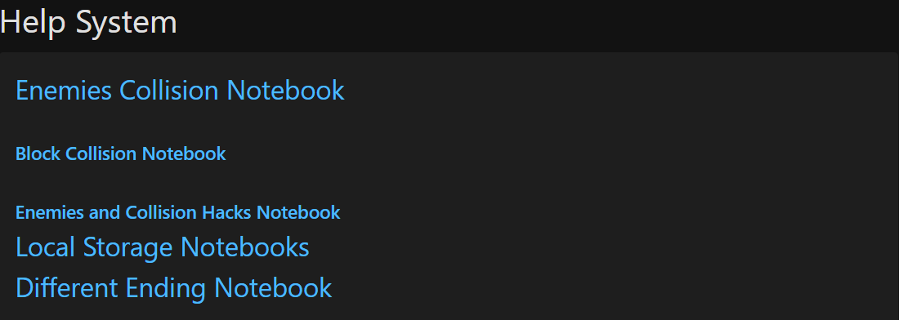
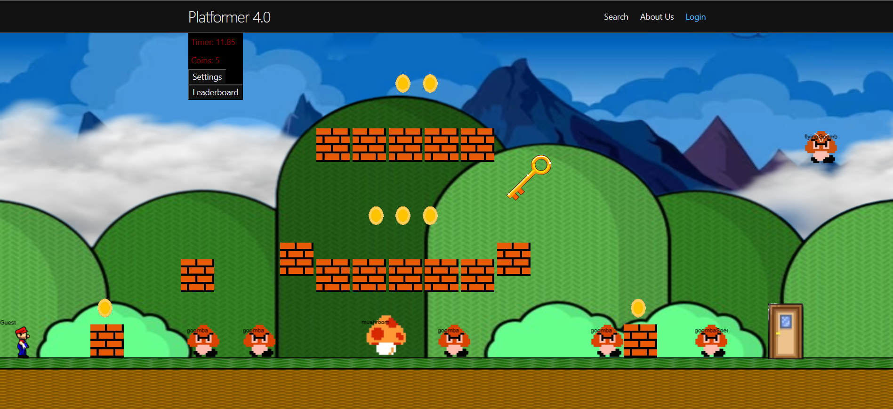
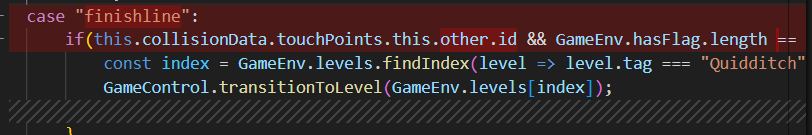
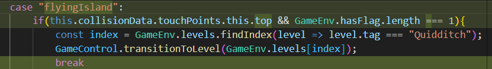

### Week 18 Journal Entry: 1/18/2025

This week, we accomplished 3 things:

1. We had finished all of the Enemies and Collisions help system notebooks, and successfully presented them on Friday.
2. I had finished the Different ending notebook, and this was to help my peers understand how to create a different ending.

3. We finished remodeling the game level, and made Mario more mobile throughout the map. 

Next week, we wanted to clean up the level, and create additional bonuses for collecting all of the coins, or defeating all of the enemies. 

### Week 19 Journal Entry: 1/25/2025

This week, since our scrummaster was absent, we had some issues with our code. 

However, this week was dedicated to fine-tuning the locations of the sprites (which Ethan crushed), and I decided to create some
bonuses in the level. (Ethan also remodeled the level to make the player even more mobile and allow for more enemies)

If the player collected all of the pieces of trash around the map, and put them in the trash can, the player 
will recieve a size bonus or a coin multiplier (still deciding). Ethan will be responsible for the sprites and their respective positions. 
Cason will provide pseudo code for each file involved. I will use his code and edit it to meet our needs.

### Week 20 Journal Entry: 2/1/2025

This week, the rest of the class was assigned the adventure game, and me, Lucas, Ethan W, Aaryav, and Cason were the only 
people left working on the platformer game. So, we decided to delete some of the levels (minilevels, water level), and we each
took care of a level to work on. I chose the winter level, and created a combination of the original winter level and the
spring-themed level. 

### Week 21 Journal Entry: 2/8/2025

This week, I started working on the finish line logic. My idea was to spread bags of trash around the level, and if the player
collected all of them, they would be able to leave. I was able to successfully implement this logic, and animated the cave so that the player
slowly dissappears to make it seem like the player was actually going through a cave. I was also able to remodel the level to give the player 
more mobility throughout the map. 

### Week 22 (Ski Week): 2/22/2025

This week, I was debugging Cason's code to make sure that his logic was running smoothly. I was able to debug his ending, and made sure 
that the player could leave the level if and only if they collected the flag and they were on top of the island. This week, before
Night at the Museum, I really want to dig into the fine details of the game (block placement, best mobility of player, etc.)

***Before***

***After***
