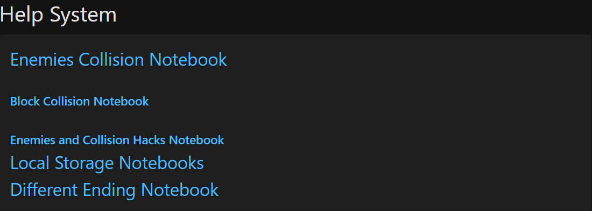
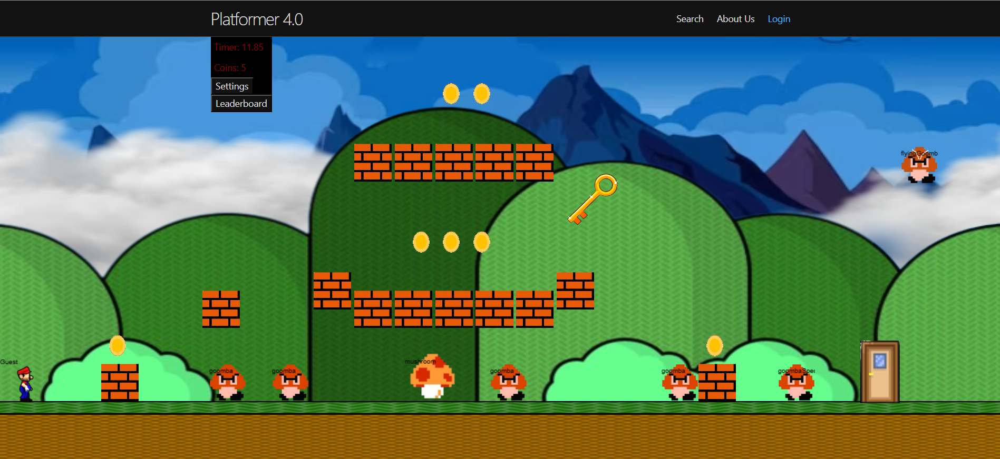

### Week 18 Journal Entry: 1/18/2025

This week, we accomplished 3 things:

1. We had finished all of the Enemies and Collisions help system notebooks, and successfully presented them on Friday.
2. I had finished the Different ending notebook, and this was to help my peers understand how to create a different ending.

3. We finished remodeling the game level, and made Mario more mobile throughout the map. 

Next week, we wanted to clean up the level, and create additional bonuses for collecting all of the coins, or defeating all of the enemies. 