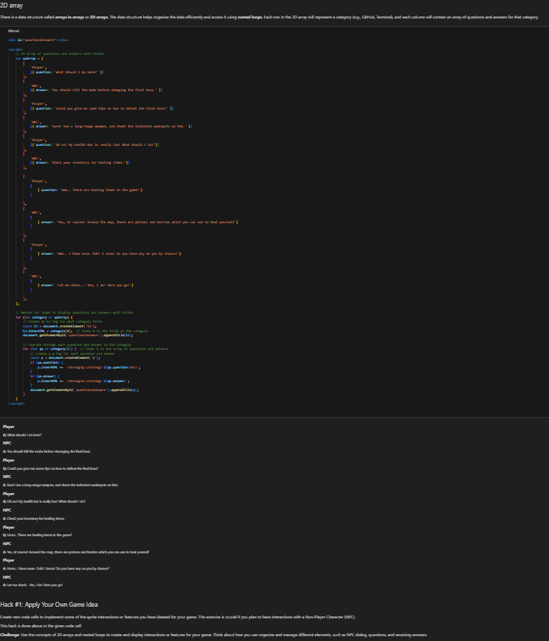
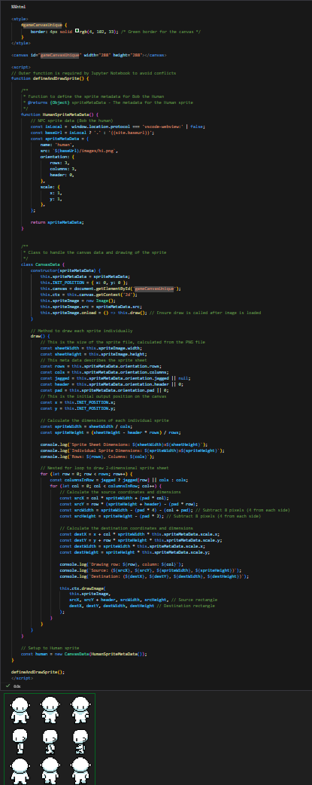

# Popcorn Hacks

 

## JSON Object:
*Here are some basic definitions that are included in this hack:*
- rpg.md: This is an HTML file and uses other files to help run the game. 
- GameControl: This is a JS file that uses "object literal pattern" to design controls for the game.
- Background & Turtle: This is for the background and the turtle itself. 
- GameEnv: This determines the sizes of the canvas properties.

 

## New Background
Here is a screenshot of my new background with the sprite: 

 

## Player Popcorn Hack:
*Dependencies are outside modules that you class needs in order to use specific methods or features.*
- Here is some example code from player.js to illustrate this: 

file:///home/chronos/u-187f5e7304e68048d0e1b377184e52b47c75387f/MyFiles/Downloads/Screenshot%202024-09-25%208.41.45%20PM.png

 

# RPG Game Ideas:
- ### include levels, each level has an objective the player must complete, which will increase in difficulty as you progress into the game.
- ### incorporate sound effects for the player to have a more intense gaming experience
- ### should have multiple sprites, some for specific levels. For example, we can include a monster sprite that can chase the player through the maze. 

 

## Gaming Hacks
- ### Hack 1: Use 2D Array For Game: 
    **This hack was done to demonstrate an example of some sort of communication between the player and the NPC**

 

- ### Hack 2: Use Different Sprites:
    **This hack was done to demonstrate an example of the usage of different sprite files, no matter the shape or size.**

